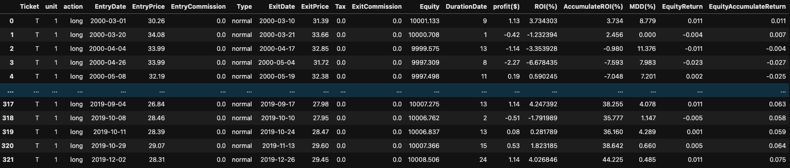
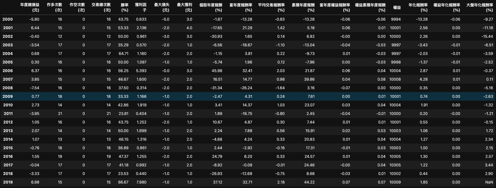
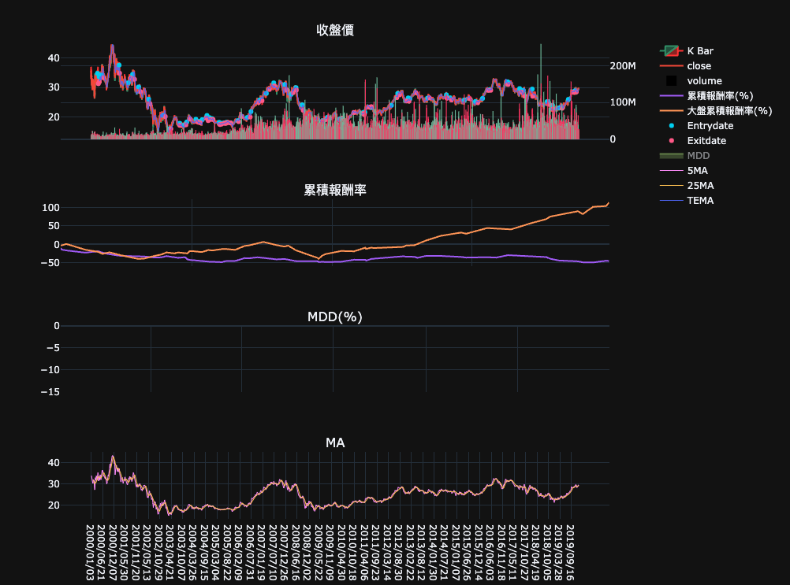

# alphabt

# Overview

Backtest the stock with long strategy or short strategy，the following features:

- long strategy or short strategy 
- long-short strategy 
- stop loss
- stop profit
- TaLib feature

# Strategy Method and Property

- close() : when you want to close the position
- long() : long action
- short(): short action
- long_position -> Boolean: in long position
- short_position -> Boolean: in short position
- empty_position -> Boolean: in empty position 

# Usage

- Strategy (long direction):

    Buy :  8TEMA > 13TEMA

    Sell : 13TEMA > 8TEMA

```python
class TEMA(Strategy):
		"""
		unit can be integer or ratio, which respresent the unit of stock or 
    the ratio of equity to buy stock , respectively
		"""
    def __init__(self):
        # setting your data
        self.data = data
        # use the TaLib feature
        self.tema_8 = self.indicator('TEMA', 8)['TEMA'].vaiues
        self.tema_13 = self.indicator('TEMA', 13)['TEMA'].values


    def signal(self, index):

        super().signal(index)
        # Only buy the stock with empty position
        if (self.tema_8[index] > self.tema_13[index]) & (self.empty_position):
            self.long()
        # Only sell with long position
        if (self.tema_13[index] > self.tema_8[index]) & (self.long_position):
            self.close()

bt = Backtest(TEMA, , initial_equity=10000, commission=None)
bt.run()
log, per = bt.get_report()

# plot
Bt(TEMA).get_plot(subplot_technical_index=['MA'], overlap=['TEMA'], sub_plot_param={'MA':[20, 60]}, overlap_param=None, log=log)
```

- trading report




- performance



- Figure



# TODO

1. Defensive programmingfeature such as equity
2. Test 
3. bug with plot moduel: when the DurationDate is equal to 'zero'
4. portfolio